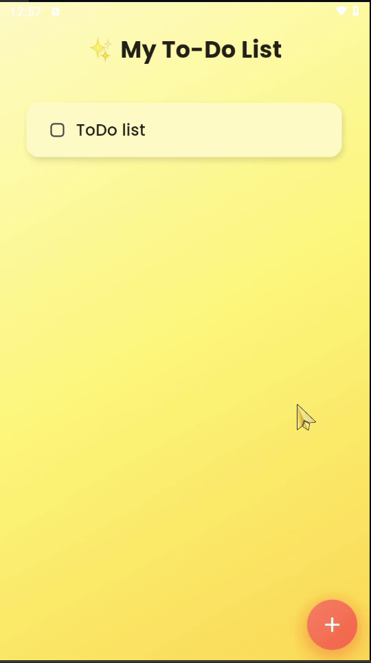

# ✅ To-Do App

A simple and beautiful **Flutter To-Do application** with **Hive database** for offline storage.  
Add, check, and delete your tasks with an elegant UI and smooth experience. 🚀

[](https://flutter.dev)  
[](https://docs.hivedb.dev/)

---

## 📑 Table of Contents
- [✨ Features](#-features)
- [🛠️ Technologies](#️-technologies)
- [📸 Screenshots](#-screenshots)
- [🎥 Demo](#-demo)
- [🚀 Getting Started](#-getting-started)

---

## ✨ Features
- ➕ Add new tasks with a custom dialog  
- ✅ Mark tasks as completed  
- 🗑 Swipe to delete tasks (Slidable)  
- 💾 Local storage with Hive database  
- 🎨 Gradient background and custom FAB  

---

## 🛠️ Technologies
- **Flutter (Dart)**  
- **Hive (Local Database)**  
- **Slidable (Swipe to delete)**  
- **Google Fonts** for modern typography  

---

## 📸 Screenshots

### App Flow
<!-- Path updated to `screenshts/` folder where your images live -->


---

## 🎥 Demo


**GIF version (recommended for README):**



---

## 🚀 Getting Started

To run this project locally:

```bash
# Clone the repository
git clone https://github.com/your-username/to_do_app.git

# Navigate to project directory
cd to_do_app

# Get dependencies
flutter pub get

# Run the app (choose a device/emulator first)
flutter run
